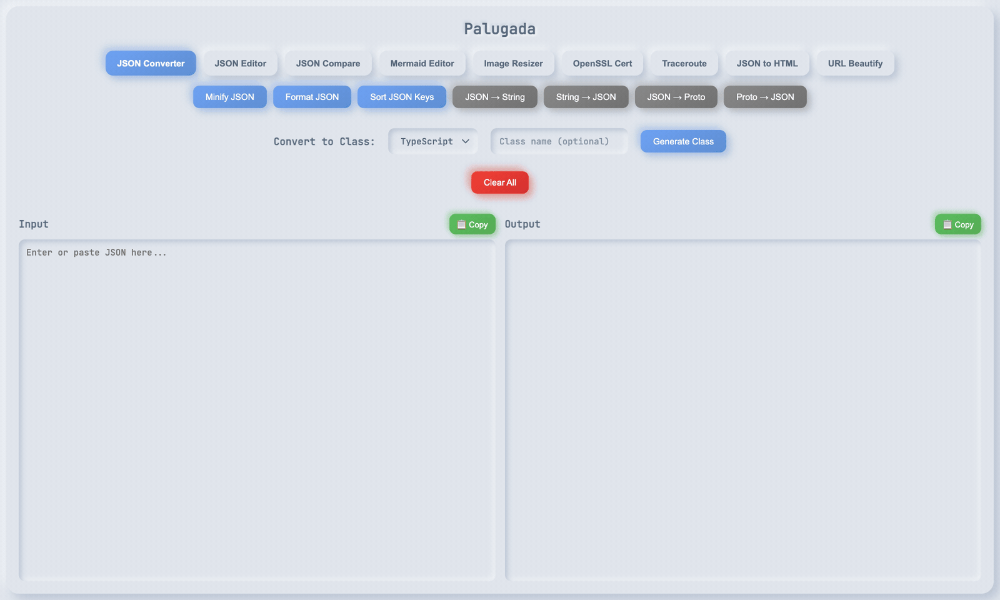

# Palugada (JSON Formatter & Developer Swiss Army Knife)



A fast, lightweight, and versatile desktop toolbox built with **Rust** and **Tauri** with a modern tab-based interface.

---

## 🚀 Features

### 1. 🌲 JSON Editor *(New)*

* **Visual Tree & Code Split View**: Interactive visual node tree editor synchronized in real-time with raw JSON code.
* **In-Place Key & Value Editing**: Directly edit keys or values independently without breaking structure.
* **Type Switcher**: On-the-fly data type conversion (`string`, `number`, `boolean`, `null`, `object`, `array`).
* **✨ Smart Array Auto-Add**: Automatically duplicates schema/properties of existing array items with empty/default values (`""`, `0`, `false`, `[]`, `{}`).
* **🔄 Stringified JSON Detection & Unpack**: Auto-detects escaped JSON strings in values (e.g. nested payloads/Kafka logs) and unpacks them into native objects/arrays with one click.
* **🪄 Auto-Fix JSON**: Repairs malformed JSON instantly (single quotes, unquoted keys, trailing commas, JavaScript comments).
* **Key Case Converter**: Recursively converts keys to `camelCase`, `snake_case`, `kebab-case`, or `PascalCase`.
* **🛡️ Data Masking (PII Anonymizer)**: Masks sensitive data like emails, phone numbers, passwords, and tokens for safe sharing.
* **Search & Filter**: Real-time keyword search with instant node highlighting.
* **Node Utilities**: Duplicate items, move up/down, delete, expand/collapse all, and copy JSONPath (`$.users[0].name`).

### 2. 🔄 JSON Converter

* **Minify & Format**: Fast JSON indentation and whitespace removal.
* **Sort Keys**: Alphabetically sorts keys in nested JSON.
* **String Literal Conversions**: JSON &harr; Escaped String.
* **Schema & Code Generation**:
  * JSON &harr; Protocol Buffers (proto3)
  * JSON &rarr; Models / Classes for **TypeScript, JavaScript, Python, Rust, Java, C#, Go, Kotlin, Swift**
  * JSON &rarr; YAML, XML, CSV, and JMESPath querying.

### 3. 🔍 JSON Compare

* **Side-by-Side Diff**: Compare two JSON payloads with structural normalization.
* **Per-side Beautifier**: Format and clean left or right payloads independently before diffing.
* **Visual Diff Highlighting**: Color-coded line and token differences with copyable diff reports.

### 4. 🌐 URL Beautifier

* **URL Component Parser**: Breaks down URLs into Protocol, Hostname, Port, Path, and Hash/Fragment.
* **Query Parameters Editor**: Add, edit, remove, and duplicate query parameters interactively.
* **Reconstruct & Encode/Decode**: Live URL reconstruction and complete encoding/decoding.

### 5. 📄 JSON to HTML

* **Template Rendering**: Inject JSON values into custom HTML templates using `{{key}}` syntax.
* **Live HTML Preview**: Real-time rendering and preview of the resulting HTML markup.

### 6. 📊 Mermaid Editor

* **Live Diagram Rendering**: Author flowcharts, sequence diagrams, and class diagrams with real-time SVG rendering.
* **Interactive Canvas**: Zoom in/out, pan, reset view, and export to PNG.

### 7. 🖼️ Image Resizer & Background Remover

* **Resizing Modes**: Scale by percentage or exact dimensions with aspect-ratio preservation.
* **Quality & Format**: Quality-based compression and PNG conversion.
* **Background Removal**: Flood-fill background transparency with adjustable tolerance.

### 8. 🔒 OpenSSL Certificate Inspector

* **Certificate Parsing**: Inspect PEM text or base64 DER certificates.
* **Fetch Server Certificates**: Pull TLS certificates directly from any HTTPS URL.
* **Chain Inspection & Fingerprints**: Leaf or full-chain inspection, validity dates, SHA-256 fingerprint, and public key pin.

### 9. 🗺️ Traceroute & Network Enrichment

* **Real-time Traceroute**: Run traceroute directly against domains or IPs.
* **Enriched Metadata**: Auto-resolves reverse DNS, ASN, Organization, and Geo location for public hops.
* **Formatted ASCII Output**: Clean, readable hop table summary.

### 10. 🎭 Local Mock & Proxy Server *(New)*
* **🌐 REST Mock & Transparent Proxy**:
  * Dynamic matching for exact path, path parameters (`/api/users/:id`), and wildcards (`*`).
  * Custom HTTP methods, status codes, latency simulation, and custom response headers/body.
  * **Origin Forwarder (Fallback Reverse Proxy)**: Forwards unhandled requests to real upstream servers (e.g. staging API) with full headers and body preservation.
  * **🪄 1-Click "Record to Mock"**: Converts any intercepted upstream response into a local mock rule instantly!
* **⚡ Dynamic gRPC Mocking**:
  * **Pure-Rust Proto Compiler**: Parses `.proto` files dynamically in memory using `protox` without requiring external `protoc` binary.
  * Service & RPC Explorer: Inspects RPC methods, input types, and output types.
  * Dynamic Protobuf encoding/decoding and JSON schema mock generation.
* **📜 Live Traffic Inspector**:
  * Intercepts and logs all incoming traffic in real-time.
  * Complete Request/Response headers & payload inspector with filter by type/source.
* **💾 Local SQLite Persistence**:
  * Uses bundled `rusqlite` to store all rules, configs, proto files, and traffic history permanently.

---

## 🛠️ Tech Stack

* **Backend**: Rust, Tauri v2, Serde, OpenSSL, native system tools (`traceroute`, `curl`, `nslookup`).
* **Frontend**: HTML5, Vanilla JavaScript, Custom Neumorphic CSS design system, Mermaid.js.

---

## 📦 Getting Started

### Prerequisites

* **Rust 1.70+** (`curl --proto '=https' --tlsv1.2 -sSf https://sh.rustup.rs | sh`)
* **Tauri CLI**: `cargo install tauri-cli`
* **System Dependencies**:
  * **macOS**: Xcode Command Line Tools (`xcode-select --install`)
  * **Linux**: `sudo apt install libwebkit2gtk-4.1-dev build-essential curl wget file libxdo-dev libssl-dev libayatana-appindicator3-dev librsvg2-dev`
  * **Windows**: Microsoft C++ Build Tools
* **Node.js 18+**: Required only for frontend unit tests. Follow the [official Node.js installation guide](https://nodejs.org/en/download/package-manager).

Frontend tests use Node.js built-ins (`node:test` and `node:assert/strict`). No npm packages or `npm install` are required.

### Running in Development

```bash
# Run the application with hot reload
cargo tauri dev
```

### Building for Production

```bash
cargo tauri build
```

Tauri reads `frontend/.taurignore` during the build. It excludes `frontend/test/`, `*.test.js`, and `frontend/plan.md` from the bundled application. Tests remain available in the source tree for local development.

Built binaries and installers are generated in `src-tauri/target/release/bundle/`:

* **macOS**: `.dmg`, `.app` *(See [INSTALL_MAC.md](INSTALL_MAC.md) for Gatekeeper notes)*
* **Linux**: `.deb`, `.AppImage`
* **Windows**: `.msi`, `.exe`

---

## 🏗️ Frontend Architecture

Frontend uses native browser ES modules. No bundler or frontend framework required.

```text
index.html
    ↓ loads
main.js                         # Entry point and shared input normalization
    ├── tabs.js                  # Generic data-tab/data-section router
    ├── converter.js             # JSON formatting and code generation UI
    ├── compare.js               # JSON comparison UI
    ├── openssl.js               # Certificate inspector UI
    ├── traceroute.js            # Network tracing UI
    ├── json-html.js             # JSON-to-HTML UI
    ├── url-beautifier.js        # URL parsing and query editor UI
    ├── image-resizer.js         # Canvas image processing UI
    ├── mermaid-editor.js        # Mermaid UI and lazy CDN loader
    └── json-editor.js           # Interactive JSON tree editor

Shared modules:
    ├── status.js                # Status notifications
    ├── clipboard.js             # Browser/Tauri clipboard fallback
    └── json-utils.js            # Shared JSON escaping, sorting, normalization

Pure logic modules:
    ├── compare-diff.js           # Line diff algorithm and serialization
    ├── mermaid-formatter.js      # Mermaid formatting
    ├── url-parser.js             # URL parsing and reconstruction
    └── json-editor-logic.js      # JSON paths, casing, masking, auto-fix

Styles:
    ├── styles.css                # Shared layout, controls, editor styles
    └── styles/*.css              # Feature-specific stylesheets
```

### Module lifecycle

* Converter initializes on startup because it is the default tab.
* Other tabs initialize on first activation through `tabs.js`.
* Each tab owns its DOM queries, event handlers, and feature state.
* Mermaid loads from CDN only when rendering or changing theme. Initial page load does not download Mermaid.
* Pure logic stays DOM-free where practical, enabling zero-dependency Node.js tests.

### Testing

After installing Node.js 18 or newer, run frontend tests from project root:

```bash
node --test frontend/test/*.test.js
```

Run Rust backend tests:

```bash
cargo test --manifest-path src-tauri/Cargo.toml
```

Run both test suites:

```bash
node --test frontend/test/*.test.js && \
  cargo test --manifest-path src-tauri/Cargo.toml
```

Frontend currently has 41 passing tests. Rust backend currently has 41 passing tests.

## 📂 Project Structure

```
json-formatter/
├── frontend/
│   ├── index.html              # Tab layout and semantic data attributes
│   ├── main.js                 # Small frontend entry point
│   ├── modules/                # Tab modules, shared utilities, pure logic
│   ├── styles.css              # Shared CSS
│   ├── styles/                 # Feature CSS split by tab
│   └── test/                   # Native node:test suites
├── src-tauri/
│   ├── src/main.rs             # Tauri commands and desktop entry point
│   ├── src/lib.rs              # Shared Rust command logic and unit tests
│   ├── Cargo.toml              # Rust dependencies
│   └── tauri.conf.json         # Tauri configuration
├── docs/                       # Assets and screenshots
├── run.sh                      # Helper launch script
└── README.md
```
